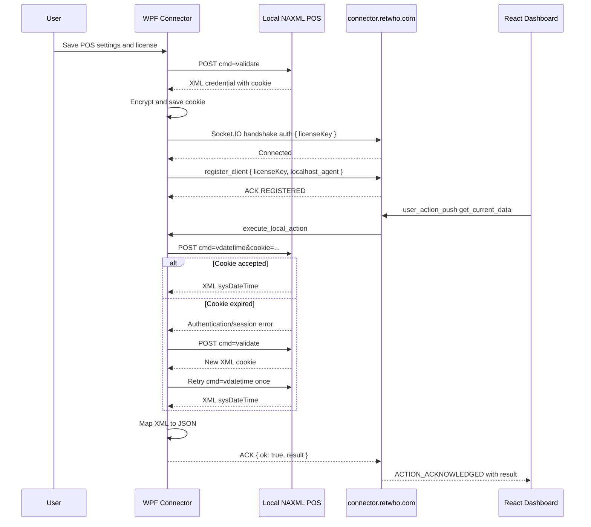

# Retwho Windows Connector: AI Implementation Guide

> Version: 1.1
>
> Specification date: 2026-07-31
>
> Target: WPF on .NET 10 LTS
>
> Cloud bridge: `https://connector.retwho.com`
>
> Audience: a coding AI, a C# developer, or a future Codex session

## 1. How to use this document

Give this entire Markdown file to the coding AI that can edit the Visual Studio workspace. If available, also attach:

- `login.txt`
- `vdatetime.txt`
- `socket.txt`

The examples in those files may contain a real POS password, license key, or cookie. The implementation must never copy those values into source code, tests, documentation, output, or logs. This document uses placeholders intentionally.

The coding AI must work directly in the Windows connector workspace, create the complete solution, restore packages, compile, test, and fix errors. It must not stop after returning an architecture description or a few snippets.

### Instructions to the implementing AI

1. Treat this document as the final source of truth.
2. Inspect the three supplied text files only to confirm the request and XML shapes.
3. Use fake values in fixtures and examples.
4. Create all files described below.
5. Do not leave `TODO`, `NotImplementedException`, placeholder handlers, or pseudocode in the generated application.
6. Verify all `SocketIOClient` calls against version `4.0.5`.
7. Run the build, unit tests, and Windows publish command before reporting completion.
8. If an API differs from an example in this guide, use the compile-correct API for the pinned package while preserving the behavior defined here.
9. Treat the request-header profile in section 11 as required POS protocol compatibility, not optional browser decoration.

## 2. Purpose and scope

Retwho Connector is a Windows desktop agent installed inside a customer's local network. It creates a secure, real-time bridge between:

1. A local POS/NAXML HTTPS endpoint that accepts commands and returns XML.
2. The existing multi-tenant Socket.IO bridge at `https://connector.retwho.com`.
3. A React dashboard already connected to the bridge.

The Windows application uses:

- The POS base URL, POS username, and POS password only for the local NAXML server.
- The license key only for the Socket.IO bridge.
- The cookie returned inside the POS login XML for later POS operations.

It must never:

- Connect directly to the bridge MySQL database.
- Register or create a license.
- Send the POS password, username, or cookie to the cloud bridge.
- Use raw WebSocket protocol in place of Socket.IO.
- Disable certificate validation globally.
- Execute `vdatetime` simply because the socket connected.

### Version-one features

- WPF configuration screen.
- Encrypted local settings.
- Safe POS certificate trust and fingerprint pinning.
- Exact NAXML compatibility request headers from `login.txt`.
- Success and error response-header capture.
- gzip, deflate, Brotli, and zstd response decoding.
- POS login using `cmd=validate`.
- XML cookie extraction.
- Socket.IO authentication and `localhost_agent` registration.
- Reconnection and re-registration.
- `get_current_data` command processing.
- Fresh POS `vdatetime` request for each accepted command.
- Automatic cookie refresh and one retry.
- Namespace-independent XML parsing.
- XML-to-JSON mapping.
- Exactly-once Socket.IO acknowledgement.
- Local redacted logs.
- Unit tests and a self-contained Windows x64 build.

### Explicitly outside version one

- `receive_web_data`.
- Local write-back or POS mutation commands.
- Periodic `vdatetime` polling.
- Periodic `agent_data_push`.
- Windows Service mode.
- MySQL access.
- License registration.

## 3. Confirmed design decisions

| Decision | Required behavior |
|---|---|
| Windows framework | WPF |
| Runtime | .NET 10 LTS |
| Architecture | MVVM with dependency injection and focused services |
| Bridge library | `SocketIOClient` `4.0.5` |
| Bridge URL | Fixed as `https://connector.retwho.com` |
| Bridge role | `localhost_agent` |
| POS protocol | HTTPS POST requests to NAXML |
| POS request headers | Exact browser-compatible profile verified in `login.txt` |
| POS response | XML |
| Response headers | Capture on success and error; log only a safe allowlist |
| Socket payload | camelCase JSON |
| `vdatetime` timing | Only after `execute_local_action` with `get_current_data` |
| Cookie refresh | Login once and retry `vdatetime` once |
| Inbound push | Not implemented in version one |
| Settings security | Windows DPAPI, current Windows user |
| Local TLS | Normal trust or explicitly confirmed SHA-256 certificate pin |
| Bridge TLS | Always normal strict validation |
| Command deadline | Internal target of 8 seconds; bridge waits 10 seconds |
| Duplicate agent | `session_replaced` stops the older application |
| Duplicate action | `actionId` shares/reuses one bounded execution result |

## 4. End-to-end flow



## 5. Recommended solution tree

```text
RetwhoConnector/
├── RetwhoConnector.sln
├── Directory.Build.props
├── Directory.Packages.props
├── README.md
├── .gitignore
├── src/
│   ├── RetwhoConnector.App/
│   │   ├── RetwhoConnector.App.csproj
│   │   ├── App.xaml
│   │   ├── App.xaml.cs
│   │   ├── MainWindow.xaml
│   │   ├── MainWindow.xaml.cs
│   │   ├── Converters/
│   │   │   ├── BooleanToVisibilityConverter.cs
│   │   │   └── StatusToBrushConverter.cs
│   │   ├── Styles/
│   │   │   ├── Colors.xaml
│   │   │   └── Controls.xaml
│   │   └── ViewModels/
│   │       └── MainWindowViewModel.cs
│   └── RetwhoConnector.Core/
│       ├── RetwhoConnector.Core.csproj
│       ├── Abstractions/
│       │   ├── IActionExecutionRegistry.cs
│       │   ├── IBridgeSocketClient.cs
│       │   ├── ICertificateTrustService.cs
│       │   ├── IPosAuthenticationService.cs
│       │   ├── IPosDataService.cs
│       │   ├── IPosResponseReader.cs
│       │   ├── ISecureSettingsService.cs
│       │   └── IVdatetimeXmlMapper.cs
│       ├── Configuration/
│       │   ├── BridgeOptions.cs
│       │   ├── PosCompatibilityHeaders.cs
│       │   └── PosOptions.cs
│       ├── Exceptions/
│       │   ├── ConnectorException.cs
│       │   ├── PosAuthenticationException.cs
│       │   ├── PosCertificateException.cs
│       │   ├── PosResponseException.cs
│       │   └── PosTimeoutException.cs
│       ├── Models/
│       │   ├── AgentDataPushResponse.cs
│       │   ├── BridgeAction.cs
│       │   ├── BridgeAcknowledgement.cs
│       │   ├── BridgeEnvelope.cs
│       │   ├── ConnectorSettings.cs
│       │   ├── ConnectorStatus.cs
│       │   ├── PosHttpResponse.cs
│       │   ├── PosResponseMetadata.cs
│       │   ├── PosSession.cs
│       │   ├── RegistrationResponse.cs
│       │   ├── TimeZoneInfoDto.cs
│       │   └── VdatetimeResult.cs
│       ├── Security/
│       │   ├── CertificateFingerprint.cs
│       │   ├── SecretProtector.cs
│       │   └── SensitiveDataRedactor.cs
│       └── Services/
│           ├── ActionExecutionRegistry.cs
│           ├── BridgeSocketClient.cs
│           ├── CertificateTrustService.cs
│           ├── ConnectorCoordinator.cs
│           ├── PosAuthenticationService.cs
│           ├── PosDataService.cs
│           ├── PosHttpRequestFactory.cs
│           ├── PosResponseReader.cs
│           ├── SecureSettingsService.cs
│           └── VdatetimeXmlMapper.cs
└── tests/
    └── RetwhoConnector.Tests/
        ├── RetwhoConnector.Tests.csproj
        ├── Fakes/
        │   ├── FakeBridgeSocketClient.cs
        │   ├── FakeHttpMessageHandler.cs
        │   └── FakeTimeProvider.cs
        ├── Fixtures/
        │   ├── login-success.xml
        │   ├── login-missing-cookie.xml
        │   ├── vdatetime-success.xml
        │   ├── vdatetime-invalid-offset.xml
        │   └── pos-session-expired.xml
        ├── ActionExecutionRegistryTests.cs
        ├── BridgeSocketClientTests.cs
        ├── CertificateTrustServiceTests.cs
        ├── ConnectorCoordinatorTests.cs
        ├── PosAuthenticationServiceTests.cs
        ├── PosDataServiceTests.cs
        ├── PosHttpRequestFactoryTests.cs
        ├── PosResponseReaderTests.cs
        ├── SecureSettingsServiceTests.cs
        ├── SensitiveDataRedactorTests.cs
        └── VdatetimeXmlMapperTests.cs
```

## 6. Project creation order

Create the solution in this order so every step remains understandable and compile-safe.

### Step 1: Create the solution and projects

Run in a Visual Studio Developer PowerShell or terminal:

```powershell
dotnet new sln -n RetwhoConnector
dotnet new wpf -n RetwhoConnector.App -o src/RetwhoConnector.App -f net10.0
dotnet new classlib -n RetwhoConnector.Core -o src/RetwhoConnector.Core -f net10.0
dotnet new xunit -n RetwhoConnector.Tests -o tests/RetwhoConnector.Tests -f net10.0

dotnet sln RetwhoConnector.sln add src/RetwhoConnector.App/RetwhoConnector.App.csproj
dotnet sln RetwhoConnector.sln add src/RetwhoConnector.Core/RetwhoConnector.Core.csproj
dotnet sln RetwhoConnector.sln add tests/RetwhoConnector.Tests/RetwhoConnector.Tests.csproj

dotnet add src/RetwhoConnector.App/RetwhoConnector.App.csproj reference src/RetwhoConnector.Core/RetwhoConnector.Core.csproj
dotnet add tests/RetwhoConnector.Tests/RetwhoConnector.Tests.csproj reference src/RetwhoConnector.Core/RetwhoConnector.Core.csproj
```

The WPF and core projects should use `net10.0-windows`, because DPAPI and WPF are Windows-specific.

### Step 2: Add shared build rules

Create `Directory.Build.props`:

```xml
<Project>
  <PropertyGroup>
    <Nullable>enable</Nullable>
    <ImplicitUsings>enable</ImplicitUsings>
    <LangVersion>latest</LangVersion>
    <TreatWarningsAsErrors>true</TreatWarningsAsErrors>
    <AnalysisLevel>latest</AnalysisLevel>
    <Deterministic>true</Deterministic>
  </PropertyGroup>
</Project>
```

If a third-party generated warning prevents the build, suppress only that documented warning in the narrowest project. Do not disable warnings globally.

### Step 3: Centralize package versions

Create `Directory.Packages.props`:

```xml
<Project>
  <PropertyGroup>
    <ManagePackageVersionsCentrally>true</ManagePackageVersionsCentrally>
  </PropertyGroup>

  <ItemGroup>
    <PackageVersion Include="CommunityToolkit.Mvvm" Version="8.4.2" />
    <PackageVersion Include="Microsoft.Extensions.Hosting" Version="10.0.10" />
    <PackageVersion Include="Microsoft.Extensions.Http" Version="10.0.10" />
    <PackageVersion Include="Serilog" Version="4.4.0" />
    <PackageVersion Include="Serilog.Extensions.Hosting" Version="10.0.0" />
    <PackageVersion Include="Serilog.Sinks.File" Version="7.0.0" />
    <PackageVersion Include="SocketIOClient" Version="4.0.5" />
    <PackageVersion Include="System.Security.Cryptography.ProtectedData" Version="10.0.10" />
    <PackageVersion Include="ZstdSharp.Port" Version="0.8.8" />

    <PackageVersion Include="Microsoft.NET.Test.Sdk" Version="18.8.1" />
    <PackageVersion Include="coverlet.collector" Version="10.0.1" />
    <PackageVersion Include="xunit" Version="2.9.3" />
    <PackageVersion Include="xunit.runner.visualstudio" Version="3.1.5" />
  </ItemGroup>
</Project>
```

These versions reflect stable packages available when this specification was written. If a package must be changed, document why and rerun the complete build and test suite.

## 7. Project files

### 7.1 `src/RetwhoConnector.App/RetwhoConnector.App.csproj`

Purpose:

- Defines the WPF executable.
- References the core project.
- Adds MVVM, Generic Host, and logging packages.

Example:

```xml
<Project Sdk="Microsoft.NET.Sdk">
  <PropertyGroup>
    <OutputType>WinExe</OutputType>
    <TargetFramework>net10.0-windows</TargetFramework>
    <UseWPF>true</UseWPF>
    <AssemblyName>RetwhoConnector</AssemblyName>
    <RootNamespace>RetwhoConnector.App</RootNamespace>
  </PropertyGroup>

  <ItemGroup>
    <ProjectReference Include="..\RetwhoConnector.Core\RetwhoConnector.Core.csproj" />
  </ItemGroup>

  <ItemGroup>
    <PackageReference Include="CommunityToolkit.Mvvm" />
    <PackageReference Include="Microsoft.Extensions.Hosting" />
    <PackageReference Include="Serilog.Extensions.Hosting" />
    <PackageReference Include="Serilog.Sinks.File" />
  </ItemGroup>
</Project>
```

### 7.2 `src/RetwhoConnector.Core/RetwhoConnector.Core.csproj`

Purpose:

- Contains all network, socket, XML, settings, security, and coordination logic.
- Does not reference WPF controls.

Example:

```xml
<Project Sdk="Microsoft.NET.Sdk">
  <PropertyGroup>
    <TargetFramework>net10.0-windows</TargetFramework>
    <RootNamespace>RetwhoConnector.Core</RootNamespace>
  </PropertyGroup>

  <ItemGroup>
    <PackageReference Include="Microsoft.Extensions.Http" />
    <PackageReference Include="Microsoft.Extensions.Hosting" />
    <PackageReference Include="Serilog" />
    <PackageReference Include="SocketIOClient" />
    <PackageReference Include="System.Security.Cryptography.ProtectedData" />
    <PackageReference Include="ZstdSharp.Port" />
  </ItemGroup>
</Project>
```

### 7.3 `tests/RetwhoConnector.Tests/RetwhoConnector.Tests.csproj`

Purpose:

- Runs isolated tests without contacting the real POS or production bridge.

Example:

```xml
<Project Sdk="Microsoft.NET.Sdk">
  <PropertyGroup>
    <TargetFramework>net10.0-windows</TargetFramework>
    <IsPackable>false</IsPackable>
    <IsTestProject>true</IsTestProject>
  </PropertyGroup>

  <ItemGroup>
    <PackageReference Include="Microsoft.NET.Test.Sdk" />
    <PackageReference Include="xunit" />
    <PackageReference Include="xunit.runner.visualstudio">
      <PrivateAssets>all</PrivateAssets>
      <IncludeAssets>runtime; build; native; contentfiles; analyzers</IncludeAssets>
    </PackageReference>
    <PackageReference Include="coverlet.collector">
      <PrivateAssets>all</PrivateAssets>
      <IncludeAssets>runtime; build; native; contentfiles; analyzers</IncludeAssets>
    </PackageReference>
  </ItemGroup>

  <ItemGroup>
    <ProjectReference Include="..\..\src\RetwhoConnector.Core\RetwhoConnector.Core.csproj" />
  </ItemGroup>

  <ItemGroup>
    <None Update="Fixtures\*.xml">
      <CopyToOutputDirectory>PreserveNewest</CopyToOutputDirectory>
    </None>
  </ItemGroup>
</Project>
```

### 7.4 `.gitignore`

Purpose:

- Prevents build output, user-specific Visual Studio files, runtime settings, logs, and publish artifacts from entering source control.

Minimum entries:

```gitignore
.vs/
**/bin/
**/obj/
TestResults/
*.user
*.suo
*.log
publish/

# Never commit copied runtime settings or exported secrets
settings.json
settings.*.json
```

Do not ignore XML fixtures stored under `tests/RetwhoConnector.Tests/Fixtures/`; those must contain only fake values.

## 8. Model file guide

All JSON-facing model properties must serialize using the exact camelCase names expected by the bridge. Use either global camelCase configuration or explicit `[JsonPropertyName]` attributes. Using both is acceptable when it prevents ambiguity.

### 8.1 `ConnectorSettings.cs`

Purpose:

- Represents the decrypted settings available to the running application.
- Must not be logged as an object.

Suggested shape:

```csharp
public sealed record ConnectorSettings
{
    public required string PosBaseUrl { get; init; }
    public required string PosUsername { get; init; }
    public required string PosPassword { get; init; }
    public required string LicenseKey { get; init; }
    public string? PosCookie { get; init; }
    public string? PinnedCertificateSha256 { get; init; }
    public bool AutoConnect { get; init; }
}
```

Validation rules:

- POS URL must be absolute HTTPS.
- URL path should be empty or normalized to the origin.
- License key must be non-empty and no more than 255 characters.
- The server accepts license characters matching letters, numbers, `.`, `_`, `:`, `~`, and `-`.
- Username and password must be non-empty.

### 8.2 `BridgeAction.cs`

Purpose:

- Deserializes the first argument of `execute_local_action`.

Example:

```csharp
public sealed record BridgeAction
{
    public required string ActionId { get; init; }
    public required string Command { get; init; }
    public JsonElement Params { get; init; }
    public required DateTimeOffset Timestamp { get; init; }
}
```

Validation example:

```text
actionId: non-empty UUID-like correlation value
command: exactly "get_current_data" in version one
params: JSON object
timestamp: valid ISO-8601 timestamp
```

Do not require the action ID to be a GUID if the bridge later changes its ID format; require a non-empty, safely bounded string.

### 8.3 `BridgeAcknowledgement.cs`

Purpose:

- Creates the exact success or failure object sent to the bridge.

Example:

```csharp
public sealed record BridgeAcknowledgement
{
    public required bool Ok { get; init; }
    public object? Result { get; init; }
    public string? Error { get; init; }

    public static BridgeAcknowledgement Success(object result) =>
        new() { Ok = true, Result = result };

    public static BridgeAcknowledgement Failure(string error) =>
        new() { Ok = false, Error = error };
}
```

Do not include `result` on failures or `error` on successes if the serializer is configured to ignore nulls.

### 8.4 `TimeZoneInfoDto.cs`

Example:

```csharp
public sealed record TimeZoneInfoDto
{
    public required string TimeZoneId { get; init; }
    public required int OffsetMinutes { get; init; }
    public required bool DstApplies { get; init; }
}
```

### 8.5 `VdatetimeResult.cs`

This is the exact object returned to React through the command acknowledgement.

```csharp
public sealed record VdatetimeResult
{
    public string Source { get; init; } = "NAXML";
    public string Command { get; init; } = "vdatetime";
    public required string SiteId { get; init; }
    public required string SystemDateTime { get; init; }
    public required string SystemTimeZoneId { get; init; }
    public required IReadOnlyList<TimeZoneInfoDto> TimeZones { get; init; }
    public required string RawXml { get; init; }
    public required DateTimeOffset FetchedAtUtc { get; init; }
}
```

Expected JSON:

```json
{
  "source": "NAXML",
  "command": "vdatetime",
  "siteId": "6720",
  "systemDateTime": "2026-07-30T14:31:18-04:00",
  "systemTimeZoneId": "US/Eastern",
  "timeZones": [
    {
      "timeZoneId": "US/Eastern",
      "offsetMinutes": -300,
      "dstApplies": true
    }
  ],
  "rawXml": "<?xml version=\"1.0\"?>...",
  "fetchedAtUtc": "2026-07-31T08:20:01.250Z"
}
```

### 8.6 `ConnectorStatus.cs`

Purpose:

- Gives the ViewModel a single immutable status snapshot.

Recommended fields:

```text
POS configuration state
POS authentication state
Bridge transport state
Agent registration state
Last command state
Last command timestamp
Safe user-facing message
```

Use enums internally instead of comparing status strings.

### 8.7 `BridgeEnvelope.cs`

Purpose:

- Deserializes the bridge's standard `{ ok, code, message?, data? }` response.
- Used for registration and `agent_data_push`; it is not the same as the incoming-command acknowledgement.

Example:

```csharp
public sealed record BridgeEnvelope<TData>
{
    public required bool Ok { get; init; }
    public required string Code { get; init; }
    public string? Message { get; init; }
    public TData? Data { get; init; }
}
```

Do not treat `ok=true` alone as registration success. Registration requires both `ok=true` and `code="REGISTERED"`.

### 8.8 `RegistrationResponse.cs`

Purpose:

- Represents the `data` inside the registration response.

Example:

```csharp
public sealed record RegistrationResponse
{
    public required string Room { get; init; }
    public required string ClientType { get; init; }
}
```

The `room` contains the license key. Never log the full registration data object or room name.

### 8.9 `AgentDataPushResponse.cs`

Example:

```csharp
public sealed record AgentDataPushResponse
{
    public required long LogId { get; init; }
    public required DateTimeOffset Timestamp { get; init; }
}
```

The bridge envelope must also have `code="DATA_ACCEPTED"` before treating the push as successful.

### 8.10 `PosSession.cs`

Example:

```csharp
public sealed record PosSession
{
    public required string Cookie { get; init; }
    public string? SiteId { get; init; }
    public required DateTimeOffset ObtainedAtUtc { get; init; }
}
```

Never include the cookie in `ToString()`, structured logging, exception messages, equality-debug output, or UI status.

### 8.11 `BridgeOptions.cs`

Purpose:

- Centralizes non-secret bridge defaults.
- The production URL is fixed and not editable in the normal UI.

Example:

```csharp
public sealed class BridgeOptions
{
    public Uri Url { get; init; } = new("https://connector.retwho.com");
    public string Path { get; init; } = "/socket.io";
    public TimeSpan RegistrationTimeout { get; init; } = TimeSpan.FromSeconds(8);
    public TimeSpan ActionAcknowledgementTimeout { get; init; } = TimeSpan.FromSeconds(10);
    public TimeSpan CommandDeadline { get; init; } = TimeSpan.FromSeconds(8);
    public int MaximumPayloadBytes { get; init; } = 1024 * 1024;
}
```

Do not place a license key in this options class.

### 8.12 `PosOptions.cs`

Purpose:

- Defines safe local POS limits.

Example:

```csharp
public sealed class PosOptions
{
    public string NaxmlPath { get; init; } = "/cgi-bin/NAXML";
    public string ConfigClientPath { get; init; } = "/ConfigClient.html";
    public TimeSpan SetupRequestTimeout { get; init; } = TimeSpan.FromSeconds(15);
    public int MaximumResponseBytes { get; init; } = 2 * 1024 * 1024;
}
```

Command-time POS calls still use the coordinator's shorter shared command deadline.

### 8.13 `PosCompatibilityHeaders.cs`

Purpose:

- Defines the exact legacy/browser-compatible NAXML request-header profile verified in `login.txt`.
- Keeps the header values in one place so login and `vdatetime` cannot drift apart.

Example constants:

```csharp
public static class PosCompatibilityHeaders
{
    public const string UserAgent =
        "Mozilla/5.0 (Windows NT 10.0; Win64; x64) " +
        "AppleWebKit/537.36 (KHTML, like Gecko) " +
        "Chrome/150.0.0.0 Safari/537.36";

    public const string AcceptEncoding = "gzip, deflate, br, zstd";
    public const string AcceptLanguage = "en-US,en;q=0.9,bn;q=0.8";
    public const string SecFetchDest = "empty";
    public const string SecFetchMode = "cors";
    public const string SecFetchSite = "same-origin";
    public const string SecChUa =
        "\"Not;A=Brand\";v=\"8\", " +
        "\"Chromium\";v=\"150\", " +
        "\"Google Chrome\";v=\"150\"";
    public const string SecChUaMobile = "?0";
    public const string SecChUaPlatform = "\"Windows\"";
}
```

These are compatibility values for this specific legacy POS protocol. Do not silently replace them with a generic application user agent unless integration tests prove the POS accepts it.

### 8.14 `PosResponseMetadata.cs`

Purpose:

- Records the safe, useful parts of the HTTP status and response headers.
- Keeps header inspection separate from the XML business model.

Example:

```csharp
public sealed record PosResponseMetadata
{
    public required int StatusCode { get; init; }
    public string? ReasonPhrase { get; init; }
    public string? ContentType { get; init; }
    public long? ContentLength { get; init; }
    public IReadOnlyList<string> ContentEncodings { get; init; } = [];
    public DateTimeOffset? Date { get; init; }
    public string? Server { get; init; }
    public string? Connection { get; init; }
    public TimeSpan? RetryAfter { get; init; }
    public bool HasSetCookieHeader { get; init; }
    public bool HasWwwAuthenticateHeader { get; init; }
}
```

Do not store the values of `Set-Cookie` or `WWW-Authenticate`. Boolean presence is sufficient for safe diagnostics. The NAXML application cookie still comes from the XML `<cookie>` element.

### 8.15 `PosHttpResponse.cs`

Example:

```csharp
public sealed record PosHttpResponse
{
    public required PosResponseMetadata Metadata { get; init; }
    public required string Body { get; init; }
}
```

Do not override `ToString()` to include `Body`, because a login body contains the POS cookie.

### 8.16 Exception files

Create a small typed exception hierarchy. Each exception exposes a stable safe code, while its detailed inner exception remains local.

`ConnectorException.cs` contains the shared base class:

Example base:

```csharp
public abstract class ConnectorException : Exception
{
    protected ConnectorException(
        string code,
        string safeMessage,
        Exception? innerException = null)
        : base(safeMessage, innerException)
    {
        Code = code;
        SafeMessage = safeMessage;
    }

    public string Code { get; }
    public string SafeMessage { get; }
}
```

Files and intended codes:

| File | Example code |
|---|---|
| `PosAuthenticationException.cs` | `POS_LOGIN_FAILED` or `POS_AUTH_EXPIRED` |
| `PosCertificateException.cs` | `POS_CERTIFICATE_UNTRUSTED` or `POS_CERTIFICATE_CHANGED` |
| `PosResponseException.cs` | `POS_HTTP_ERROR`, `POS_UNSUPPORTED_CONTENT_ENCODING`, `POS_INVALID_XML`, or `POS_INVALID_RESPONSE` |
| `PosTimeoutException.cs` | `POS_TIMEOUT` |

Never put a request URI, cookie, password, or raw login response into an exception message.

## 9. Abstraction file guide

Interfaces make the coordinator testable without real network access.

### 9.1 `IBridgeSocketClient.cs`

Responsibilities:

- Connect and register.
- Disconnect.
- Raise safe connection-state changes.
- Deliver incoming commands.
- Send acknowledgements exactly through the underlying event context.
- Provide `agent_data_push` for future/manual use.

Example shape:

```csharp
public interface IBridgeSocketClient : IAsyncDisposable
{
    bool IsTransportConnected { get; }
    bool IsRegistered { get; }

    event EventHandler<BridgeConnectionStateChangedEventArgs>? StateChanged;
    event Func<BridgeActionContext, CancellationToken, Task>? ActionReceived;
    event EventHandler? SessionReplaced;

    Task ConnectAsync(string licenseKey, CancellationToken cancellationToken);
    Task DisconnectAsync(CancellationToken cancellationToken);
    Task<AgentDataPushResponse> PushAgentDataAsync(
        object payload,
        CancellationToken cancellationToken);
}
```

`BridgeActionContext` should contain:

- Parsed `BridgeAction`.
- A safe `AcknowledgeOnceAsync(BridgeAcknowledgement)` method.
- The connection/session cancellation token.

Do not expose the third-party Socket.IO event context to the ViewModel.

### 9.2 `IPosAuthenticationService.cs`

```csharp
public interface IPosAuthenticationService
{
    Task<PosSession> LoginAsync(
        ConnectorSettings settings,
        CancellationToken cancellationToken);
}
```

`PosSession` contains the cookie and optional site ID. Never override `ToString()` with secret data.

### 9.3 `IPosDataService.cs`

```csharp
public interface IPosDataService
{
    Task<VdatetimeResult> GetVdatetimeAsync(
        ConnectorSettings settings,
        string cookie,
        CancellationToken cancellationToken);
}
```

Cookie refresh belongs in the coordinator or a dedicated session manager, not inside the XML mapper.

### 9.4 `ISecureSettingsService.cs`

```csharp
public interface ISecureSettingsService
{
    Task<ConnectorSettings?> LoadAsync(CancellationToken cancellationToken);
    Task SaveAsync(ConnectorSettings settings, CancellationToken cancellationToken);
    Task ClearAsync(CancellationToken cancellationToken);
}
```

### 9.5 `IVdatetimeXmlMapper.cs`

```csharp
public interface IVdatetimeXmlMapper
{
    VdatetimeResult Parse(string xml, DateTimeOffset fetchedAtUtc);
}
```

The mapper must be deterministic and contain no HTTP or settings logic.

### 9.6 `ICertificateTrustService.cs`

Example:

```csharp
public interface ICertificateTrustService
{
    Task<PresentedCertificate> InspectAsync(
        Uri posBaseUri,
        CancellationToken cancellationToken);

    bool ValidateForRequest(
        Uri requestUri,
        X509Certificate2 certificate,
        SslPolicyErrors policyErrors,
        string? approvedSha256);
}
```

`PresentedCertificate` contains only display-safe certificate metadata and the SHA-256 fingerprint. It must not contain POS credentials.

### 9.7 `IActionExecutionRegistry.cs`

Example:

```csharp
public interface IActionExecutionRegistry
{
    Task<BridgeAcknowledgement> ExecuteAsync(
        string actionId,
        Func<CancellationToken, Task<BridgeAcknowledgement>> factory,
        CancellationToken cancellationToken);
}
```

The interface hides cache and concurrency details from the coordinator.

### 9.8 `IPosResponseReader.cs`

Example:

```csharp
public interface IPosResponseReader
{
    Task<PosHttpResponse> ReadAsync(
        HttpResponseMessage response,
        int maximumDecompressedBytes,
        CancellationToken cancellationToken);
}
```

`PosHttpResponse` combines `PosResponseMetadata` with the bounded, decoded response-body string. It must never expose unsafe headers through its logging representation.

## 10. Security file guide

### 10.1 `SecretProtector.cs`

Purpose:

- Wraps Windows DPAPI.
- Keeps encryption details out of the settings service.

Example behavior:

```csharp
byte[] plaintext = Encoding.UTF8.GetBytes(secret);
byte[] protectedBytes = ProtectedData.Protect(
    plaintext,
    optionalEntropy,
    DataProtectionScope.CurrentUser);
string storedValue = Convert.ToBase64String(protectedBytes);
```

Decryption reverses the operation with `ProtectedData.Unprotect`.

Requirements:

- Use a stable, application-specific entropy byte array.
- Do not use the license key or password as entropy.
- Handle invalid Base64 and DPAPI failures with a safe settings exception.
- Do not log input, output, or ciphertext.
- Store secrets for the current Windows user, not the entire machine.

### 10.2 `SecureSettingsService.cs`

Settings path:

```text
%LocalAppData%\RetwhoConnector\settings.json
```

The disk DTO should make encrypted fields unmistakable:

```json
{
  "schemaVersion": 1,
  "posBaseUrl": "https://10.1.10.250",
  "encryptedPosUsername": "BASE64_DPAPI_DATA",
  "encryptedPosPassword": "BASE64_DPAPI_DATA",
  "encryptedLicenseKey": "BASE64_DPAPI_DATA",
  "encryptedPosCookie": "BASE64_DPAPI_DATA",
  "encryptedCertificateSha256": "BASE64_DPAPI_DATA",
  "autoConnect": true
}
```

Atomic save process:

1. Create the application directory.
2. Serialize to a temporary file in the same directory.
3. Flush the temporary stream.
4. Replace the previous file atomically when supported.
5. Fall back to a safe same-volume move when no previous file exists.
6. Remove only the known temporary file after a handled failure.

Never overwrite a corrupted settings file silently. Show a clear user action to back it up or clear it.

### 10.3 `SensitiveDataRedactor.cs`

It must redact:

- `passwd` and `password` query/body values.
- `cookie`.
- License key.
- Authorization-like values.
- DPAPI-encrypted values if accidentally passed to the logger.

Example:

```text
Input:
POST /cgi-bin/NAXML?cmd=validate&user=EXAMPLE&passwd=secret

Safe output:
POST /cgi-bin/NAXML?cmd=validate&user=<redacted>&passwd=<redacted>
```

Prefer logging named operations such as `POS validate request failed` instead of logging a redacted URL.

### 10.4 `CertificateFingerprint.cs`

Purpose:

- Normalizes an X.509 certificate SHA-256 fingerprint.
- Compares pins without case, spaces, or colon ambiguity.

Output format example:

```text
9A4BD3...64_HEX_CHARACTERS
```

Use SHA-256 over `certificate.RawData`.

### 10.5 `CertificateTrustService.cs`

Normal flow:

- If Windows considers the POS certificate valid, no pin is required.
- If self-signed, retrieve the server certificate without sending HTTP credentials.
- Show subject, issuer, validity dates, and SHA-256 fingerprint.
- Ask the user to approve it explicitly.
- Save the approved pin using DPAPI.

For a one-time discovery connection, a certificate callback may capture the presented certificate only because no application credentials or POS request are sent. The user must still verify and approve the fingerprint. The production `HttpClient` callback must never simply return `true`.

Pinned-request validation requires:

```text
request host == configured POS host
AND
presented SHA-256 == stored SHA-256
```

The cloud bridge does not use this pinning callback. It always uses the system certificate trust store.

## 11. POS HTTP file guide

### 11.1 `PosHttpRequestFactory.cs`

Purpose:

- Builds login and vdatetime requests consistently.
- Applies the complete compatibility header set found in `login.txt`.
- Prevents accidental logging or malformed URLs.

Login request:

```http
POST https://{POS_HOST}/cgi-bin/NAXML?cmd=validate&user={USERNAME}&passwd={PASSWORD}
Content-Type: text/plain; charset=UTF-8
User-Agent: Mozilla/5.0 (Windows NT 10.0; Win64; x64) AppleWebKit/537.36 (KHTML, like Gecko) Chrome/150.0.0.0 Safari/537.36
Referer: https://{POS_HOST}/ConfigClient.html
Host: {POS_HOST}
Connection: keep-alive
Accept-Encoding: gzip, deflate, br, zstd
Accept-Language: en-US,en;q=0.9,bn;q=0.8
Origin: https://{POS_HOST}
Sec-Fetch-Dest: empty
Sec-Fetch-Mode: cors
Sec-Fetch-Site: same-origin
sec-ch-ua: "Not;A=Brand";v="8", "Chromium";v="150", "Google Chrome";v="150"
sec-ch-ua-mobile: ?0
sec-ch-ua-platform: "Windows"

cmd=validate&user={USERNAME}&passwd={PASSWORD}
```

Vdatetime request:

```http
POST https://{POS_HOST}/cgi-bin/NAXML?cmd=vdatetime&cookie={COOKIE}
Content-Type: text/plain; charset=UTF-8
User-Agent: Mozilla/5.0 (Windows NT 10.0; Win64; x64) AppleWebKit/537.36 (KHTML, like Gecko) Chrome/150.0.0.0 Safari/537.36
Referer: https://{POS_HOST}/ConfigClient.html
Host: {POS_HOST}
Connection: keep-alive
Accept-Encoding: gzip, deflate, br, zstd
Accept-Language: en-US,en;q=0.9,bn;q=0.8
Origin: https://{POS_HOST}
Sec-Fetch-Dest: empty
Sec-Fetch-Mode: cors
Sec-Fetch-Site: same-origin
sec-ch-ua: "Not;A=Brand";v="8", "Chromium";v="150", "Google Chrome";v="150"
sec-ch-ua-mobile: ?0
sec-ch-ua-platform: "Windows"

cmd=vdatetime&cookie={COOKIE}
```

The supplied PowerShell does not explicitly set an `Accept` request header. Do not invent one in the strict compatibility profile unless a real POS integration test proves it is accepted.

Rules:

- Build the endpoint with `UriBuilder`.
- Encode each value using an appropriate form/query encoder.
- The URL query and body must carry the same command values.
- Encode the body to UTF-8 bytes and use `ByteArrayContent` so the byte length is explicit.
- Apply the same compatibility headers to both `validate` and `vdatetime`.
- Force or prefer HTTP/1.1 for this legacy endpoint so `Host` and `Connection: keep-alive` behave as expected.
- Set `request.Headers.Host` from the validated POS URI authority. Never take it from a separate free-text field.
- Set the browser-compatible `User-Agent`, `Referer`, `Origin`, `Sec-Fetch-*`, and `sec-ch-ua*` values exactly as shown.
- Use `TryAddWithoutValidation` only for compatibility headers that do not have a suitable strongly typed property.
- Set `Content-Length` from the UTF-8 byte-array length; never calculate it from character count.
- Use a shared response reader that understands every advertised `Content-Encoding`.
- Do not return or log a request URI containing credentials.
- Reject a POS base URL containing unexpected user-info, query, fragment, or a non-HTTPS scheme.

Compatibility-oriented C# example:

```csharp
private static void ApplyCompatibilityHeaders(
    HttpRequestMessage request,
    Uri posBaseUri)
{
    string origin = posBaseUri.GetLeftPart(UriPartial.Authority);

    request.Version = HttpVersion.Version11;
    request.VersionPolicy = HttpVersionPolicy.RequestVersionOrLower;

    request.Headers.UserAgent.ParseAdd(PosCompatibilityHeaders.UserAgent);
    request.Headers.Referrer = new Uri($"{origin}/ConfigClient.html");
    request.Headers.Host = posBaseUri.IsDefaultPort
        ? posBaseUri.Host
        : posBaseUri.Authority;
    request.Headers.Connection.Add("keep-alive");

    request.Headers.TryAddWithoutValidation(
        "Accept-Encoding",
        PosCompatibilityHeaders.AcceptEncoding);
    request.Headers.TryAddWithoutValidation(
        "Accept-Language",
        PosCompatibilityHeaders.AcceptLanguage);
    request.Headers.TryAddWithoutValidation("Origin", origin);
    request.Headers.TryAddWithoutValidation(
        "Sec-Fetch-Dest",
        PosCompatibilityHeaders.SecFetchDest);
    request.Headers.TryAddWithoutValidation(
        "Sec-Fetch-Mode",
        PosCompatibilityHeaders.SecFetchMode);
    request.Headers.TryAddWithoutValidation(
        "Sec-Fetch-Site",
        PosCompatibilityHeaders.SecFetchSite);
    request.Headers.TryAddWithoutValidation(
        "sec-ch-ua",
        PosCompatibilityHeaders.SecChUa);
    request.Headers.TryAddWithoutValidation(
        "sec-ch-ua-mobile",
        PosCompatibilityHeaders.SecChUaMobile);
    request.Headers.TryAddWithoutValidation(
        "sec-ch-ua-platform",
        PosCompatibilityHeaders.SecChUaPlatform);
}
```

Create the content before sending:

```csharp
byte[] payloadBytes = Encoding.UTF8.GetBytes(payload);
var content = new ByteArrayContent(payloadBytes);
content.Headers.ContentType = new MediaTypeHeaderValue("text/plain")
{
    CharSet = "UTF-8"
};
content.Headers.ContentLength = payloadBytes.LongLength;
request.Content = content;
```

Do not add `Content-Type` or `Content-Length` to `request.Headers`, because they belong to `request.Content.Headers`.

PowerShell-to-C# mapping:

| Working `login.txt` operation | C# `HttpRequestMessage` equivalent |
|---|---|
| `$request.Method = "POST"` | `new HttpRequestMessage(HttpMethod.Post, uri)` |
| `$request.ContentType = ...` | `request.Content.Headers.ContentType` |
| `$request.ContentLength = ...` | `request.Content.Headers.ContentLength` |
| `$request.UserAgent = ...` | `request.Headers.UserAgent.ParseAdd(...)` |
| `$request.Referer = ...` | `request.Headers.Referrer = ...` |
| `$request.Host = ...` | `request.Headers.Host = ...` |
| `$request.KeepAlive = $true` | HTTP/1.1 plus `request.Headers.Connection.Add("keep-alive")` |
| `$request.Headers.Add(name, value)` | `request.Headers.TryAddWithoutValidation(name, value)` for the verified compatibility value |

Do not use `TryAddWithoutValidation` for arbitrary user-supplied header names or values. Only the fixed compatibility header names are permitted.

### 11.2 Required request-header reference

| Header/property | Source value | Why/how it is used |
|---|---|---|
| Method | `POST` | Both NAXML commands are POST requests |
| Request URI query | Command plus encoded credentials/cookie | Required by the POS endpoint |
| Body | Same command values as the query | Required by the observed POS request shape |
| `Content-Type` | `text/plain; charset=UTF-8` | The POS expects a plain UTF-8 command body |
| `Content-Length` | UTF-8 byte length | Set on `ByteArrayContent`; do not use character count |
| `User-Agent` | Exact Chrome 150 compatibility value | Reproduces the working request in `login.txt` |
| `Referer` | `{origin}/ConfigClient.html` | Reproduces the same-origin browser request |
| `Host` | Validated POS URI authority | HTTP/1.1 routing; typed property or automatic equivalent |
| Keep-alive | Enabled | Reuses the local connection |
| `Accept-Encoding` | `gzip, deflate, br, zstd` | Reproduces the working compatibility request |
| `Accept-Language` | `en-US,en;q=0.9,bn;q=0.8` | Reproduces the supplied language preference |
| `Origin` | POS origin | Reproduces same-origin behavior |
| `Sec-Fetch-Dest` | `empty` | Browser compatibility metadata |
| `Sec-Fetch-Mode` | `cors` | Browser compatibility metadata |
| `Sec-Fetch-Site` | `same-origin` | Browser compatibility metadata |
| `sec-ch-ua` | Exact supplied brand/version string | Browser client-hint compatibility |
| `sec-ch-ua-mobile` | `?0` | Declares non-mobile client compatibility |
| `sec-ch-ua-platform` | `"Windows"` | Declares Windows client compatibility |

Tests must verify the emitted request rather than assuming `HttpClient` used the requested values.

### 11.3 `PosResponseReader.cs` and response headers

`login.txt` enumerates every response header for both successful and error HTTP responses. The pasted sample does not contain fixed response-header values, so the application must capture the actual values at runtime.

Send with:

```csharp
using HttpResponseMessage response = await httpClient.SendAsync(
    request,
    HttpCompletionOption.ResponseHeadersRead,
    cancellationToken);
```

Do not call `EnsureSuccessStatusCode()` before inspecting the status, headers, and bounded error body.

HTTP response headers live in two collections:

```csharp
response.Headers          // general response headers
response.Content.Headers  // content headers
```

Capture safe metadata:

```csharp
var metadata = new PosResponseMetadata
{
    StatusCode = (int)response.StatusCode,
    ReasonPhrase = response.ReasonPhrase,
    ContentType = response.Content.Headers.ContentType?.ToString(),
    ContentLength = response.Content.Headers.ContentLength,
    ContentEncodings = response.Content.Headers.ContentEncoding.ToArray(),
    Date = response.Headers.Date,
    Server = string.Join(" ", response.Headers.Server),
    Connection = string.Join(", ", response.Headers.Connection),
    RetryAfter = response.Headers.RetryAfter?.Delta,
    HasSetCookieHeader = response.Headers.Contains("Set-Cookie"),
    HasWwwAuthenticateHeader =
        response.Headers.WwwAuthenticate.Count > 0
};
```

If the package/API shape differs slightly, keep the same safe metadata and compile against .NET 10.

#### Response-header usage table

| Status/header | How to use it |
|---|---|
| HTTP status code | `2xx` may proceed; `401/403` indicates login/session failure; other codes become typed HTTP errors |
| Reason phrase | Safe UI/diagnostic context, never the only error decision |
| `Content-Type` | Prefer XML types, but tolerate a legacy missing or `text/plain` type only when a bounded successful body is valid XML |
| `Content-Length` | Reject a declared body larger than the configured limit before reading; still enforce a streamed/decompressed limit |
| `Content-Encoding` | Decode every advertised encoding in reverse application order before XML parsing |
| `Date` | Optional safe timing diagnostic |
| `Server` | Optional safe diagnostic; do not make business decisions from it |
| `Connection` / `Keep-Alive` | Diagnostic only; `HttpClient` manages pooling |
| `Retry-After` | May schedule a transient retry when a command deadline allows it; never sleep past the bridge acknowledgement deadline |
| `WWW-Authenticate` | Presence supports authentication-error classification; do not log its value |
| `Set-Cookie` | Do not use it as the NAXML application cookie and never log its value |

The POS application cookie is taken from:

```xml
<cookie>SERVER_GENERATED_COOKIE</cookie>
```

inside the successful login XML body. It is not taken from `Set-Cookie` unless a future, separately verified POS contract explicitly requires that.

#### Response decompression

Because the compatibility request advertises:

```text
gzip, deflate, br, zstd
```

the response reader must be able to decode:

- gzip with `GZipStream`
- deflate with `DeflateStream`
- br with `BrotliStream`
- zstd with the pinned `ZstdSharp.Port` package

Decode stacked content encodings in reverse order. Enforce the configured limit on the decompressed bytes to prevent a decompression bomb. If an unknown encoding arrives, return:

```text
POS_UNSUPPORTED_CONTENT_ENCODING
```

Do not parse compressed bytes as XML.

#### Response-header logging

Log only an allowlist:

```text
statusCode
contentType
contentLength
contentEncodings
date
server
retryAfter
hasSetCookieHeader
hasWwwAuthenticateHeader
```

Normalize allowlisted string values by removing CR/LF/control characters and limiting their length before UI or log output. Headers are untrusted server input even when the POS is local.

Never log:

```text
Set-Cookie value
WWW-Authenticate value
Authorization or Proxy-Authorization
cookie from the XML
password/username query
full request URI
unknown headers before security review
```

Safe log example:

```json
{
  "operation": "POS validate",
  "statusCode": 200,
  "contentType": "text/xml; charset=UTF-8",
  "contentEncodings": ["gzip"],
  "contentLength": 101343,
  "hasSetCookieHeader": false
}
```

### 11.4 `PosAuthenticationService.cs`

Process:

1. Build the `validate` request.
2. Apply and verify the complete compatibility request-header profile.
3. Send with `ResponseHeadersRead`.
4. Capture safe response metadata for success and error statuses.
5. Read/decompress through `PosResponseReader`.
6. Enforce HTTP and decompressed-body size limits.
7. Require a successful status, unless a typed error maps the actual status.
8. Parse XML securely.
9. Require root local name `credential`.
10. Find the first direct/descendant element with local name `cookie`.
11. Require a non-empty cookie.
12. Ignore any `Set-Cookie` value for NAXML authentication.
13. Optionally read `site`.
14. Return `PosSession`.

Safe login fixture:

```xml
<?xml version="1.0"?>
<domain:credential
    xmlns:domain="urn:vfi-sapphire:np.domain.2001-07-01"
    xmlns:vs="urn:vfi-sapphire:vs.2001-10-01">
  <cookie>FAKE_COOKIE_FOR_TESTS_ONLY</cookie>
  <vs:site>6720</vs:site>
  <funcList>
    <Function>
      <FunctionDisplay>View Date and Time</FunctionDisplay>
      <FunctionCmd>vdatetime</FunctionCmd>
    </Function>
  </funcList>
</domain:credential>
```

The real response can contain hundreds of `Function` elements. Do not map them just to obtain the cookie.

### 11.5 Secure XML reader settings

Use an `XmlReader` with settings equivalent to:

```csharp
var settings = new XmlReaderSettings
{
    DtdProcessing = DtdProcessing.Prohibit,
    XmlResolver = null,
    MaxCharactersInDocument = 2 * 1024 * 1024,
    IgnoreComments = true,
    IgnoreProcessingInstructions = false
};
```

Enforce the byte limit before allocating an unbounded response string.

### 11.6 `VdatetimeXmlMapper.cs`

Responsibilities:

- Parse only vdatetime XML.
- Use `Name.LocalName`, not namespace-prefix text.
- Preserve timezone order.
- Parse offsets with invariant culture.
- Convert `1`/`0` to Boolean.
- Preserve the exact input in `RawXml`.
- Add the injected/furnished UTC fetch time.

Safe fixture:

```xml
<?xml version="1.0"?>
<domain:sysDateTime
    xmlns:domain="urn:vfi-sapphire:np.domain.2001-07-01"
    xmlns:vs="urn:vfi-sapphire:vs.2001-10-01">
  <vs:site>6720</vs:site>
  <sysDT>2026-07-30T14:31:18-04:00</sysDT>
  <sysTzId>US/Eastern</sysTzId>
  <tZone>
    <tzId>US/Eastern</tzId>
    <offset>-300</offset>
    <dstApplies>1</dstApplies>
  </tZone>
  <tZone>
    <tzId>US/Arizona</tzId>
    <offset>-420</offset>
    <dstApplies>0</dstApplies>
  </tZone>
</domain:sysDateTime>
```

Mapping example:

```text
vs:site                   -> siteId
sysDT                     -> systemDateTime
sysTzId                   -> systemTimeZoneId
tZone/tzId                -> timeZones[].timeZoneId
tZone/offset               -> timeZones[].offsetMinutes
tZone/dstApplies "1"       -> timeZones[].dstApplies true
tZone/dstApplies "0"       -> timeZones[].dstApplies false
original response string  -> rawXml
UTC clock                 -> fetchedAtUtc
```

Reject:

- Wrong root.
- Missing `site`, `sysDT`, or `sysTzId`.
- Empty timezone ID.
- Non-integer offset.
- `dstApplies` other than `0` or `1`.
- XML with a DTD.
- Oversized response.

### 11.7 `PosDataService.cs`

Process:

1. Require a non-empty cookie.
2. Build `vdatetime` with the same complete compatibility headers used for login.
3. Send with `ResponseHeadersRead` and the command cancellation token.
4. Capture safe response metadata for every status.
5. Decode the response with `PosResponseReader`.
6. Map 401/403 to a typed authentication/session failure.
7. Inspect valid XML error responses for authentication-expiry indicators.
8. Do not treat malformed XML as definite cookie expiry.
9. Send successful XML to the mapper.
10. Verify the final JSON is below the bridge limit.

## 12. `BridgeSocketClient.cs` and Socket.IO file guide

### 12.1 Bridge connection options

The socket client must use:

```text
URI: https://connector.retwho.com
Path: /socket.io
Engine.IO: V4
Transport: WebSocket
Reconnection: enabled
Auth property: licenseKey
Serializer: System.Text.Json camelCase
```

Conceptual C# shape:

```csharp
var options = new SocketIOOptions
{
    Path = "/socket.io",
    Reconnection = true,
    ReconnectionAttempts = int.MaxValue,
    ReconnectionDelay = 1_000,
    ReconnectionDelayMax = 10_000,
    Transport = TransportProtocol.WebSocket,
    Auth = new Dictionary<string, string>
    {
        ["licenseKey"] = licenseKey
    }
};
```

The exact property types and event names must be checked against `SocketIOClient` `4.0.5`. Preserve this behavior even if the package uses a slightly different compile-time shape.

### 12.2 Registration

After every connection or reconnection, send within 10 seconds:

```text
Event: register_client
```

```json
{
  "licenseKey": "EXAMPLE-LICENSE-001",
  "clientType": "localhost_agent"
}
```

Success acknowledgement:

```json
{
  "ok": true,
  "code": "REGISTERED",
  "data": {
    "room": "room_EXAMPLE-LICENSE-001",
    "clientType": "localhost_agent"
  }
}
```

Rules:

- Handshake and registration license keys must match.
- Transport-connected is not the same as registered.
- Do not handle commands or push data before `REGISTERED`.
- Time out the local registration wait before the server's 10-second registration deadline.
- A transient registration failure should close the half-registered connection and retry a new connection.

### 12.3 Incoming command

Event:

```text
execute_local_action
```

Example action:

```json
{
  "actionId": "66f208c9-8621-4c89-a879-8c31527972a7",
  "command": "get_current_data",
  "params": {},
  "timestamp": "2026-07-31T08:20:00.000Z"
}
```

With `SocketIOClient` `4.0.5`, the handler conceptually:

1. Reads the first argument using `context.GetValue<BridgeAction>(0)`.
2. Runs the coordinator.
3. Calls the context acknowledgement method, such as `SendAckDataAsync`, with one response object.

Success:

```json
{
  "ok": true,
  "result": {
    "source": "NAXML",
    "command": "vdatetime",
    "siteId": "6720",
    "systemDateTime": "2026-07-30T14:31:18-04:00",
    "systemTimeZoneId": "US/Eastern",
    "timeZones": [],
    "rawXml": "<?xml version=\"1.0\"?>...",
    "fetchedAtUtc": "2026-07-31T08:20:01.250Z"
  }
}
```

Failure:

```json
{
  "ok": false,
  "error": "POS_TIMEOUT: The local POS did not respond before the deadline."
}
```

### 12.4 Exactly-once acknowledgement

Wrap acknowledgement with an atomic guard:

```csharp
if (Interlocked.Exchange(ref acknowledged, 1) != 0)
{
    return;
}

await context.SendAckDataAsync([response]).ConfigureAwait(false);
```

The actual implementation should place this inside `BridgeActionContext.AcknowledgeOnceAsync`, not duplicate it in every handler.

Even invalid actions and unexpected exceptions must be acknowledged once when an acknowledgement callback exists.

### 12.5 Custom server events

Handle:

| Event | Required behavior |
|---|---|
| `registered` | Confirm/display registration, but do not double-register |
| `execute_local_action` | Process supported command and acknowledge once |
| `session_replaced` | Cancel, disable reconnect, stop socket, require manual reconnect |
| `auth_error` | Stop work and classify permanent/transient code |
| `disconnect` | Update state; reconnect only when allowed |

Permanent errors:

```text
LICENSE_KEY_REQUIRED
INVALID_LICENSE_KEY
LICENSE_NOT_ACTIVE
LICENSE_KEY_MISMATCH
INVALID_CLIENT_TYPE
DUPLICATE_AGENT_REPLACED
REGISTER_TIMEOUT
```

Transient example:

```text
DATABASE_UNAVAILABLE
network loss
DNS failure
temporary TLS/connectivity failure with an otherwise valid certificate
```

Never retry an invalid certificate as if it were an ordinary network outage.

### 12.6 `agent_data_push`

Create the reusable method even though it is not automatically called in version one.

Event:

```text
agent_data_push
```

Example payload:

```json
{
  "source": "NAXML",
  "eventType": "MANUAL_TEST",
  "message": "Connector test data",
  "timestamp": "2026-07-31T08:20:01.250Z"
}
```

Success:

```json
{
  "ok": true,
  "code": "DATA_ACCEPTED",
  "data": {
    "logId": 194,
    "timestamp": "2026-07-31T08:20:01.300Z"
  }
}
```

Enforce:

- Registered role.
- JSON object only.
- UTF-8 serialized size below 1 MiB.
- 10-second acknowledgement timeout.

Handle:

```text
NOT_REGISTERED
LICENSE_NOT_ACTIVE
DATABASE_UNAVAILABLE
INVALID_PAYLOAD
PAYLOAD_TOO_LARGE
```

`get_current_data` must return through its command acknowledgement. Do not also call `agent_data_push`, because that creates duplicate delivery paths.

## 13. `ConnectorCoordinator.cs`

This file owns the end-to-end business flow but does not implement HTTP, XML parsing, DPAPI, or Socket.IO protocol details itself.

### Command algorithm

```text
Receive BridgeActionContext
  ├─ Verify connector is registered
  ├─ Validate action
  ├─ Create an 8-second linked command deadline
  ├─ Enter ActionExecutionRegistry by actionId
  ├─ If command is not get_current_data:
  │    return UNSUPPORTED_COMMAND
  ├─ Load current settings and cookie
  ├─ Enter POS session SemaphoreSlim
  ├─ Try fresh vdatetime
  ├─ If likely session expired:
  │    ├─ login exactly once
  │    ├─ save new encrypted cookie
  │    └─ retry vdatetime exactly once
  ├─ Serialize/check result size
  ├─ Return success acknowledgement
  └─ Map any exception to one safe failure acknowledgement
```

The coordinator must use a shared deadline. It must not give every nested HTTP call a fresh 8-second timeout.

### Cookie refresh pseudocode

```csharp
try
{
    return await posData.GetVdatetimeAsync(
        settings,
        RequireCookie(settings),
        commandToken);
}
catch (PosAuthenticationException)
{
    var newSession = await posAuthentication.LoginAsync(settings, commandToken);
    var updated = settings with { PosCookie = newSession.Cookie };
    await settingsService.SaveAsync(updated, commandToken);

    return await posData.GetVdatetimeAsync(
        updated,
        newSession.Cookie,
        commandToken);
}
```

The production code must guard this with:

- One refresh maximum.
- `SemaphoreSlim`.
- Remaining-deadline checks.
- Typed error mapping.
- No secret logging.

### Safe error mapping

| Internal condition | Socket error |
|---|---|
| Invalid action fields | `INVALID_ACTION: ...` |
| Unsupported command | `UNSUPPORTED_COMMAND: ...` |
| POS login rejected | `POS_LOGIN_FAILED: ...` |
| No cookie and login unavailable | `POS_COOKIE_MISSING: ...` |
| Session retry also rejected | `POS_AUTH_EXPIRED: ...` |
| Certificate not approved | `POS_CERTIFICATE_UNTRUSTED: ...` |
| Certificate fingerprint changed | `POS_CERTIFICATE_CHANGED: ...` |
| Shared deadline reached | `POS_TIMEOUT: ...` |
| HTTP non-success | `POS_HTTP_ERROR: ...` |
| Unknown response compression | `POS_UNSUPPORTED_CONTENT_ENCODING: ...` |
| Malformed XML | `POS_INVALID_XML: ...` |
| Valid but unexpected XML | `POS_INVALID_RESPONSE: ...` |
| JSON too large | `PAYLOAD_TOO_LARGE: ...` |
| App is shutting down | `COMMAND_CANCELLED: ...` |
| Unexpected exception | `INTERNAL_ERROR: ...` |

Socket errors must never include a stack trace, cookie, password, full license, or login URI.

## 14. `ActionExecutionRegistry.cs`

Purpose:

- Prevent duplicate work for the same `actionId`.
- Prepare for future side-effecting commands.

Requirements:

- Concurrent duplicates share one `Task<BridgeAcknowledgement>`.
- Retain completed results for about 15 minutes.
- Retain no more than about 500 entries.
- Clean expired entries.
- Use bounded, deterministic eviction.
- A cancelled caller must not corrupt another caller's shared result.
- The application shutdown token may cancel the shared execution.

Example test:

```csharp
[Fact]
public async Task DuplicateActionIds_ShareOneExecution()
{
    var calls = 0;
    var registry = CreateRegistry();

    Task<BridgeAcknowledgement> Factory(CancellationToken _)
    {
        Interlocked.Increment(ref calls);
        return Task.FromResult(BridgeAcknowledgement.Success(new { value = 1 }));
    }

    await Task.WhenAll(
        registry.ExecuteAsync("same-id", Factory, CancellationToken.None),
        registry.ExecuteAsync("same-id", Factory, CancellationToken.None));

    Assert.Equal(1, calls);
}
```

## 15. WPF application file guide

### 15.1 `App.xaml`

Responsibilities:

- References shared resource dictionaries.
- Does not use `StartupUri` when the window is created through dependency injection.

Example:

```xml
<Application
    x:Class="RetwhoConnector.App.App"
    xmlns="http://schemas.microsoft.com/winfx/2006/xaml/presentation"
    xmlns:x="http://schemas.microsoft.com/winfx/2006/xaml">
  <Application.Resources>
    <ResourceDictionary>
      <ResourceDictionary.MergedDictionaries>
        <ResourceDictionary Source="/Styles/Colors.xaml" />
        <ResourceDictionary Source="/Styles/Controls.xaml" />
      </ResourceDictionary.MergedDictionaries>
    </ResourceDictionary>
  </Application.Resources>
</Application>
```

### 15.2 `App.xaml.cs`

Responsibilities:

1. Acquire the named single-instance mutex.
2. Configure the Generic Host.
3. Configure Serilog.
4. Register services and ViewModels.
5. Start the host.
6. Resolve/show `MainWindow`.
7. Stop services and flush logs on exit.

Suggested registrations:

```text
Singleton:
  ISecureSettingsService
  ICertificateTrustService
  IBridgeSocketClient
  IActionExecutionRegistry
  IVdatetimeXmlMapper
  ConnectorCoordinator
  MainWindowViewModel
  MainWindow

Typed HttpClient:
  IPosAuthenticationService
  IPosDataService
```

Use one application-level `CancellationTokenSource`.

Second instance behavior:

- Display `Retwho Connector is already running.`
- Do not create another socket.
- Exit.

### 15.3 `MainWindow.xaml`

Use clear grouping:

```text
┌─────────────────────────────────────────────────────┐
│ Retwho Connector                                    │
│ Secure local POS to cloud bridge                    │
├─────────────────────────────────────────────────────┤
│ Configuration                                       │
│ License Key       [******************************]   │
│ Local POS URL     [https://10.1.10.250          ]   │
│ POS Username      [EXAMPLE_USER                  ]   │
│ POS Password      [******************************]   │
│ [x] Connect automatically on startup                │
│ [Trust POS Certificate] [Test POS Login]            │
│ [Save & Connect] [Disconnect] [Clear Saved Settings]│
├─────────────────────────────────────────────────────┤
│ Status                                              │
│ POS Configuration  ● Configured                     │
│ POS Authentication ● Authenticated                  │
│ Bridge Transport   ● Connected                      │
│ Agent Registration ● Registered                     │
│ Last Command       ● Completed                      │
├─────────────────────────────────────────────────────┤
│ Last JSON result                                    │
│ { ... }                                             │
├─────────────────────────────────────────────────────┤
│ Activity                                            │
│ 08:20:01 Command completed [safe action id]          │
└─────────────────────────────────────────────────────┘
```

Accessibility:

- Never communicate status by color alone.
- Use readable contrast.
- Give controls labels and automation names.
- Keep minimum button/text sizes usable.
- Allow keyboard navigation.
- Show validation messages next to the relevant field.

### 15.4 `MainWindow.xaml.cs`

Allowed responsibilities:

- Set the injected ViewModel as `DataContext`.
- Transfer `PasswordBox.Password` to a ViewModel command parameter or dedicated method.
- Handle closing only to invoke the ViewModel/coordinator shutdown command.

Not allowed:

- HTTP requests.
- Socket.IO calls.
- XML parsing.
- Settings encryption.
- Cookie refresh.

### 15.5 `MainWindowViewModel.cs`

Properties:

```text
LicenseKey
PosBaseUrl
PosUsername
AutoConnect
PosConfigurationStatus
PosAuthenticationStatus
BridgeStatus
RegistrationStatus
LastCommandStatus
LastJsonResult
ObservableCollection<string> ActivityItems
IsBusy
CanConnect
```

Commands:

```text
SaveAndConnectCommand
DisconnectCommand
TestPosLoginCommand
TrustPosCertificateCommand
ClearSavedSettingsCommand
```

Use `AsyncRelayCommand`.

The ViewModel:

- Validates input.
- Calls services/coordinator.
- Converts status events into UI properties.
- Never logs secrets.
- Never owns an `HttpClient` or `SocketIO` object.

### 15.6 `BooleanToVisibilityConverter.cs`

Purpose:

- Converts a ViewModel Boolean to `Visibility.Visible` or `Visibility.Collapsed`.
- Contains no application state.

Example behavior:

```text
true  -> Visible
false -> Collapsed
```

Use the built-in converter alternative if the selected .NET/WPF version provides one that meets the same need; otherwise implement `IValueConverter`.

### 15.7 `StatusToBrushConverter.cs`

Purpose:

- Maps status enums to visual brushes.
- The UI must still show status text, because color alone is not accessible.

Example mapping:

```text
Registered / Authenticated / Completed -> green
Connecting / Registering / Reconnecting -> amber
Disconnected / NotConfigured           -> neutral gray
Failed / SessionReplaced               -> red
```

Return brushes from resources when possible instead of creating new brush instances repeatedly.

### 15.8 `Styles/Colors.xaml`

Purpose:

- Defines reusable, high-contrast colors and brushes.

Example keys:

```xml
<SolidColorBrush x:Key="BackgroundBrush" Color="#0F172A" />
<SolidColorBrush x:Key="SurfaceBrush" Color="#1E293B" />
<SolidColorBrush x:Key="PrimaryTextBrush" Color="#F8FAFC" />
<SolidColorBrush x:Key="SecondaryTextBrush" Color="#CBD5E1" />
<SolidColorBrush x:Key="SuccessBrush" Color="#22C55E" />
<SolidColorBrush x:Key="WarningBrush" Color="#F59E0B" />
<SolidColorBrush x:Key="ErrorBrush" Color="#EF4444" />
```

Verify that text remains readable. Do not place low-contrast gray text on a dark-gray surface.

### 15.9 `Styles/Controls.xaml`

Purpose:

- Defines consistent TextBox, PasswordBox, Button, status-card, and section-header styles.

Requirements:

- Visible keyboard focus.
- Disabled states remain readable.
- Minimum practical control height.
- No behavior, network logic, or secrets.
- Do not depend on an external WPF theme package unless the project explicitly adds and documents it.

## 16. Logging guide

Log directory:

```text
%LocalAppData%\RetwhoConnector\Logs\
```

Recommended Serilog settings:

```csharp
.WriteTo.File(
    path: logPath,
    rollingInterval: RollingInterval.Day,
    rollOnFileSizeLimit: true,
    fileSizeLimitBytes: 10 * 1024 * 1024,
    retainedFileCountLimit: 10,
    shared: false)
```

Use UTC timestamps in the output template or JSON formatter.

Log:

- Application start and stop.
- POS certificate state and safe fingerprint.
- POS login success/failure without request details.
- Bridge connect/disconnect/reconnect.
- Registration code.
- Command start/end, safe `actionId`, duration, and result code.
- Cookie refresh attempt without cookie value.
- `session_replaced`.
- Stack traces for redacted local errors.

Never log:

- POS password.
- POS cookie.
- Full license key.
- Full login URL/body.
- Raw login XML.
- Settings object.

License fingerprint example:

```text
licenseFingerprint = first 12 hexadecimal characters of SHA-256(licenseKey)
```

The UI activity list should keep only the most recent 200 safe messages.

## 17. Connection-state rules

Use explicit states rather than several unrelated Booleans.

Suggested bridge states:

```text
Disconnected
Connecting
TransportConnected
Registering
Registered
Reconnecting
AuthenticationFailed
SessionReplaced
Stopping
```

Rules:

- `TransportConnected` must not be presented as an online registered agent.
- Only `Registered` can process `execute_local_action`.
- `session_replaced` is terminal until manual user action.
- Invalid license is terminal until settings change.
- `DATABASE_UNAVAILABLE` is transient.
- A user-requested disconnect disables reconnection.
- A network disconnect may reconnect.
- Reconnection must always repeat registration.

Suggested POS authentication states:

```text
NotConfigured
CertificateApprovalRequired
Authenticating
Authenticated
CachedSessionUnverified
RefreshingSession
AuthenticationFailed
CertificateChanged
```

On a later automatic startup:

- Load the encrypted cookie.
- Do not call `vdatetime` during startup.
- If no cookie exists, perform login before bridge connection.
- Verify cached-cookie validity when the first `get_current_data` command arrives.
- Until that first successful POS call, show `Saved POS session available (not yet verified)` instead of incorrectly claiming the cached cookie is authenticated.

## 18. Deadlines and cancellation

The bridge waits about 10 seconds for the agent acknowledgement.

Use:

- An internal command deadline around 8 seconds.
- One linked `CancellationTokenSource` for the complete command.
- Remaining-time checks before login refresh and retry.
- A separate, longer timeout for user-initiated first setup/login when no bridge command is waiting.

Example:

```csharp
using var deadline = CancellationTokenSource.CreateLinkedTokenSource(
    applicationToken,
    socketSessionToken,
    callerToken);
deadline.CancelAfter(TimeSpan.FromSeconds(8));
```

Do not create a new 8-second timer separately for login and vdatetime.

## 19. Test file guide

Tests must not call the real POS or bridge.

### 19.1 `FakeHttpMessageHandler.cs`

Create a handler that:

- Captures safe request properties.
- Returns a configured response.
- Counts calls.
- Supports delayed/cancelled responses.
- Does not record the real password or cookie in test output.

### 19.1.1 `FakeBridgeSocketClient.cs`

Purpose:

- Lets coordinator and ViewModel tests simulate socket states and commands without opening a connection.

It should support:

```text
Set transport connected/disconnected
Set registered/unregistered
Raise a BridgeActionContext
Raise session_replaced
Capture safe acknowledgement objects
Count connect, disconnect, and push calls
```

Do not use the production bridge in unit tests.

### 19.1.2 `FakeTimeProvider.cs`

Purpose:

- Makes fetched timestamps, retention expiry, retry delays, and deadline-related tests deterministic.

Prefer deriving from or wrapping .NET `TimeProvider`. Tests should be able to advance the fake clock without sleeping.

### 19.1.3 XML fixture files

Every fixture must use fake credentials and cookies.

| Fixture | Contents |
|---|---|
| `login-success.xml` | Credential root with `FAKE_COOKIE_FOR_TESTS_ONLY` |
| `login-missing-cookie.xml` | Valid credential XML without cookie |
| `vdatetime-success.xml` | Valid site, date/time, timezone ID, and timezone list |
| `vdatetime-invalid-offset.xml` | One non-numeric offset |
| `pos-session-expired.xml` | Safe representative authentication/session error |

Never copy the actual cookie or password from `login.txt` into these fixtures.

### 19.2 `PosAuthenticationServiceTests.cs`

Required cases:

```text
LoginSuccess_ExtractsCookieIgnoringNamespacePrefix
LoginSuccess_ReadsSiteId
LoginRequest_IncludesCompleteCompatibilityHeaders
SuccessResponse_CapturesSafeResponseHeaders
ErrorResponse_CapturesHeadersAndBoundedBody
MissingCookie_ThrowsSafeAuthenticationError
WrongRoot_IsRejected
OversizedResponse_IsRejected
Dtd_IsRejected
Http401_MapsToLoginFailure
Password_IsNotPresentInExceptionMessage
```

### 19.3 `VdatetimeXmlMapperTests.cs`

Required cases:

```text
ValidXml_MapsRequiredFields
ValidXml_PreservesTimezoneOrder
NegativeOffset_IsParsed
DstOne_IsTrue
DstZero_IsFalse
RawXml_IsPreservedExactly
MissingSysDateTime_IsRejected
MissingTimezoneId_IsRejected
InvalidOffset_IsRejected
InvalidDstValue_IsRejected
WrongRoot_IsRejected
Dtd_IsRejected
```

Example assertion:

```csharp
[Fact]
public void Parse_MapsTimezoneValues()
{
    string xml = Fixture.Read("vdatetime-success.xml");
    var mapper = CreateMapper();

    VdatetimeResult result = mapper.Parse(
        xml,
        new DateTimeOffset(2026, 7, 31, 8, 20, 1, TimeSpan.Zero));

    Assert.Equal("6720", result.SiteId);
    Assert.Equal("US/Eastern", result.SystemTimeZoneId);
    Assert.Equal(-300, result.TimeZones[0].OffsetMinutes);
    Assert.True(result.TimeZones[0].DstApplies);
}
```

### 19.4 `ConnectorCoordinatorTests.cs`

Required cases:

```text
GetCurrentData_CallsFreshVdatetime
GetCurrentData_ReturnsMappedSuccess
GetCurrentData_DoesNotUseHistoricalBridgeData
ExpiredCookie_LogsInAndRetriesOnce
SecondAuthenticationFailure_DoesNotRetryAgain
MalformedXml_DoesNotAutomaticallyAssumeCookieExpiry
UnsupportedCommand_ReturnsFailure
Timeout_ReturnsPosTimeout
Cancellation_ReturnsCommandCancelled
Failure_DoesNotExposeSecret
DuplicateAction_UsesOnePosCall
```

### 19.5 `BridgeSocketClientTests.cs`

Test through an adapter/fake abstraction:

```text
Connection_UsesLicenseInHandshakeAuth
Connected_RegistersWithinDeadline
Reconnect_RegistersAgain
RegistrationMismatch_IsNotAccepted
CommandsBeforeRegistration_AreRejected
Command_IsAcknowledgedExactlyOnce
SessionReplaced_DisablesReconnect
PermanentAuthError_DisablesReconnect
TransientDatabaseError_AllowsRetry
AgentDataPush_RequiresRegistration
AgentDataPush_EnforcesSize
```

### 19.6 `SecureSettingsServiceTests.cs`

```text
SaveAndLoad_RoundTripsSecretsOnWindows
SavedJson_DoesNotContainPlainSecrets
CorruptJson_IsReportedSafely
InvalidCiphertext_IsReportedSafely
ChangingPosHost_ClearsCookieAndPin
ChangingCredentials_ClearsCookie
AtomicSave_LeavesPreviousValidFileOnFailure
```

### 19.7 `SensitiveDataRedactorTests.cs`

```text
RedactsPassword
RedactsPasswd
RedactsCookie
RedactsLicense
RedactsLoginUrl
DoesNotDamageNormalStatusMessage
```

### 19.8 `CertificateTrustServiceTests.cs`

```text
SystemTrustedCertificate_IsAccepted
UntrustedCertificateWithoutPin_IsRejected
PinnedCertificateForExactHost_IsAccepted
PinnedCertificateForDifferentHost_IsRejected
ChangedFingerprint_IsRejected
FingerprintComparison_IgnoresFormatting
Discovery_DoesNotSendPosCredentials
BridgeTls_DoesNotUsePosCertificateCallback
```

### 19.9 `ActionExecutionRegistryTests.cs`

```text
DuplicateActionIds_ShareOneExecution
CompletedResult_IsReusedWithinRetention
ExpiredResult_IsExecutedAgain
Registry_DoesNotExceedMaximumEntries
ConcurrentCleanup_DoesNotCorruptActiveExecution
ApplicationShutdown_CancelsSharedExecution
```

### 19.10 `PosDataServiceTests.cs`

```text
GetVdatetime_SendsCookieInExpectedQueryAndBody
GetVdatetime_UsesTextPlainUtf8
GetVdatetime_UsesExpectedOriginAndReferer
Http401_MapsToAuthenticationFailure
Http403_MapsToAuthenticationFailure
MalformedXml_MapsToInvalidXml
UnexpectedValidXml_MapsToInvalidResponse
OversizedResponse_IsRejected
Cancellation_StopsRequest
Cookie_IsNotPresentInExceptionOrLog
```

### 19.11 `PosHttpRequestFactoryTests.cs`

Verify the exact working profile from `login.txt`:

```text
Login_UsesPost
Login_QueryAndBodyContainSameEncodedValues
Vdatetime_QueryAndBodyContainSameEncodedValues
ContentType_IsTextPlainUtf8
ContentLength_EqualsUtf8ByteLength
UserAgent_MatchesCompatibilityValue
Referer_UsesPosConfigClient
Host_MatchesValidatedPosAuthority
Connection_UsesKeepAlive
AcceptEncoding_IsGzipDeflateBrZstd
AcceptLanguage_MatchesCompatibilityValue
Origin_MatchesPosOrigin
SecFetchDest_IsEmpty
SecFetchMode_IsCors
SecFetchSite_IsSameOrigin
SecChUa_MatchesCompatibilityValue
SecChUaMobile_IsQuestionMarkZero
SecChUaPlatform_IsQuotedWindows
StrictProfile_DoesNotInventAcceptHeader
RequestDiagnostics_DoNotExposeCredentialsOrCookie
```

Inspect the final `HttpRequestMessage` received by the fake handler, including `request.Content.Headers`.

### 19.12 `PosResponseReaderTests.cs`

```text
Success_CapturesGeneralAndContentHeaders
ErrorStatus_StillCapturesHeadersAndBody
SetCookie_RecordsPresenceWithoutValue
WwwAuthenticate_RecordsPresenceWithoutValue
ContentLengthAboveLimit_IsRejectedBeforeRead
StreamingBodyAboveLimit_IsRejected
Gzip_IsDecoded
Deflate_IsDecoded
Brotli_IsDecoded
Zstd_IsDecoded
StackedEncodings_AreDecodedInReverseOrder
UnknownEncoding_ReturnsStableSafeError
DecompressedBodyLimit_PreventsCompressionBomb
HeaderLogging_UsesAllowlist
SensitiveHeaderValues_AreNeverLogged
NaxmlCookie_ComesFromXmlBodyNotSetCookie
```

## 20. README requirements for the generated Windows project

The generated Windows project must have its own `README.md`, separate from this AI implementation guide.

It must explain:

1. What Retwho Connector does.
2. Required Visual Studio and .NET 10 desktop workload.
3. Opening and building the solution.
4. First-run setup.
5. Which URL field is the local POS URL.
6. The fixed cloud bridge URL.
7. How POS login and XML cookie extraction work.
8. How to approve a self-signed POS certificate safely.
9. How Socket.IO authentication and registration work.
10. Why bridge-connected and registered are different.
11. The `get_current_data` sequence.
12. The complete required NAXML request-header table.
13. How `HttpClient` sets restricted/content headers.
14. How success and error response headers are captured.
15. Which response headers affect status, decompression, limits, and retry.
16. Why the NAXML cookie comes from XML instead of `Set-Cookie`.
17. XML and JSON examples.
18. Cookie expiry and one retry.
19. Log location and the safe response-header allowlist.
20. Error reference, including unsupported content encoding.
21. Running tests.
22. Publishing win-x64.
23. Clearing encrypted settings.
24. Header, TLS, compression, and connection troubleshooting.
25. An English and Bangla quick-start section.

## 21. Build, test, and publish

The implementing AI must run:

```powershell
dotnet restore
dotnet build RetwhoConnector.sln -c Release
dotnet test RetwhoConnector.sln -c Release --no-build
```

Publish:

```powershell
dotnet publish src/RetwhoConnector.App/RetwhoConnector.App.csproj `
  -c Release `
  -r win-x64 `
  --self-contained true `
  -p:PublishSingleFile=true `
  -p:PublishTrimmed=false `
  -p:IncludeNativeLibrariesForSelfExtract=true
```

Expected output is beneath:

```text
src\RetwhoConnector.App\bin\Release\net10.0-windows\win-x64\publish\
```

The implementing AI must report the exact actual output path after publishing.

Do not enable trimming without proving the complete WPF and Socket.IO application is trim-safe.

## 22. Manual acceptance test

Use a dedicated active test license and test POS.

### Initial connection

1. Start the WPF application.
2. Enter the license key, POS HTTPS URL, username, and password.
3. Approve the POS certificate fingerprint if self-signed.
4. Click **Save & Connect**.
5. Confirm:
   - POS configuration: Configured.
   - POS authentication: Authenticated.
   - Bridge transport: Connected.
   - Agent registration: Registered.

### Header compatibility test

1. Run `PosHttpRequestFactoryTests`.
2. Confirm the final request contains every header in section 11.2.
3. Confirm `Content-Type` and `Content-Length` are present under `request.Content.Headers`.
4. Confirm login and `vdatetime` use the same header profile.
5. Use **Test POS Login** against the real POS.
6. Confirm the UI/log shows only safe response metadata:
   - Status code.
   - Content type.
   - Content length.
   - Content encoding.
   - Safe server/date/retry metadata.
7. Confirm the response body is decoded before XML parsing.
8. Confirm no request URI, password, cookie, `Set-Cookie`, or authentication header value is logged.

If a packet-capture or debugging proxy is used during development, use only dedicated test credentials and never export a capture containing a real password or cookie.

### Live data test

From the React dashboard, send:

```json
{
  "command": "get_current_data",
  "params": {}
}
```

Confirm:

1. Bridge creates `execute_local_action`.
2. Connector calls `vdatetime` only now.
3. POS XML is mapped to JSON.
4. Connector acknowledges within 10 seconds.
5. React displays the returned JSON.
6. The response has current POS data, not historical bridge logs.
7. No secrets appear in either application log.

### Expired-cookie test

1. Invalidate the POS cookie.
2. Send `get_current_data`.
3. Confirm one `validate` request.
4. Confirm one vdatetime retry.
5. Confirm success or one safe failure.
6. Confirm no infinite request loop.

### Duplicate-agent test

1. Start a second connector with the same license.
2. Confirm the bridge registers the newer agent.
3. Confirm the first app receives `session_replaced`.
4. Confirm the first app stops reconnecting.
5. Confirm the agents do not repeatedly replace each other.

## 23. Definition of done

The implementation is complete only when:

- The WPF application opens.
- All required settings can be entered, encrypted, saved, and loaded.
- Plain secrets are absent from `settings.json`.
- Strict cloud TLS remains enabled.
- Self-signed POS trust requires explicit fingerprint approval.
- Login and `vdatetime` send the complete verified NAXML compatibility-header profile.
- `Content-Type` and UTF-8 byte-based `Content-Length` are set correctly.
- Success and error response headers are captured through the safe metadata model.
- gzip, deflate, Brotli, and zstd responses are decoded before XML parsing.
- Decompressed response size is bounded.
- Sensitive response-header values are never logged.
- Login extracts the cookie from XML.
- A valid license registers as `localhost_agent`.
- Reconnect causes re-registration.
- Invalid/revoked licenses are shown clearly.
- `session_replaced` stops the old connector.
- `vdatetime` is never called on connect/register alone.
- Every `get_current_data` makes a fresh vdatetime call.
- Expired cookies cause one login and one retry.
- XML is converted to the specified JSON.
- Original vdatetime XML is preserved in `rawXml`.
- Every command acknowledgement happens exactly once.
- The total command result is below 1 MiB.
- `receive_web_data` is not implemented.
- `agent_data_push` exists as a reusable method but is not automatically called.
- Logs contain no passwords, cookies, or full license keys.
- Unit tests pass.
- Release build passes.
- Self-contained Windows x64 publish succeeds.
- The generated project README contains English and Bangla setup summaries.

## 24. Final directive to the implementing AI

Build this as a complete Visual Studio solution. Do not return only a tutorial. Create the files, write production code, run restore/build/test/publish, repair all failures, and finish with:

1. The final solution tree.
2. A concise architecture summary.
3. Commands executed and their results.
4. Exact steps to run in Visual Studio.
5. The published executable path.
6. Any real external prerequisite that could not be tested without the user's POS or license.

Do not expose any secret found in the supplied text files.
